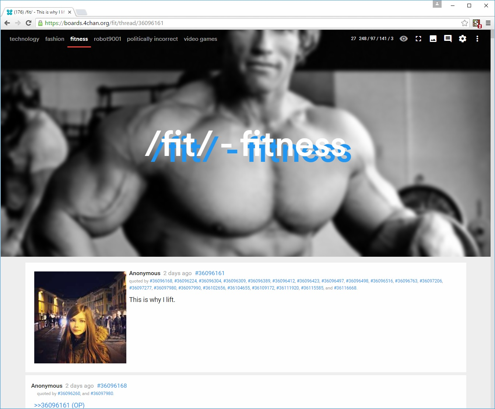
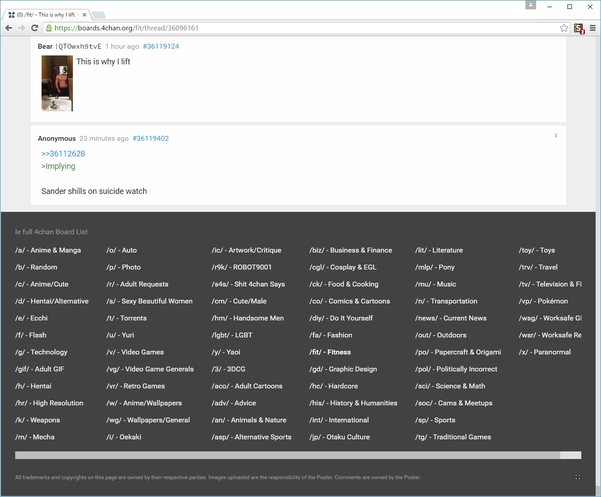

# ss16
a fresh attempt at a 4chan userstyle

following the success (or lack of) from curabitr and xl, ss16 provides a fresh and clean userstyle for use with [ccd0's 4chan x](https://ccd0.github.io/4chan-x/) in 2016!

this style is currently being actively developed for use with google chrome. you will require stylish, tampermonkey, and adblock plus. stylish to apply the style, tampermonkey to add some extra rice, and adblock plus to disable the default 4chan stylesheets. a proper guide will be created soon(tm).

##current plans
 - support as many 4chan x features as possible, for a greater "out of the box" experience
 - wait for css variables to be supported in chrome for better customisation
 - figure out how to get a css4 colour polyfill for better customisation

##future plans
 - add further rice using userscript
 - stand alone extension, to replace 4chan x
