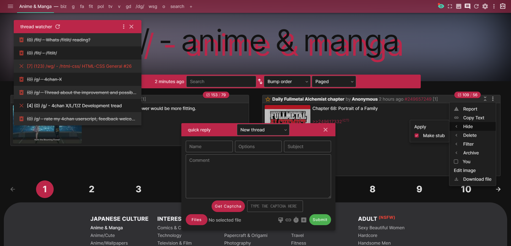

# ss21
a self-centered, fresh attempt at (user)styling 4chan



following the success (or lack of) from curabitr and xl, ss21 provides a fresh and clean userstyle for use with either [ccd0's 4chan x](https://ccd0.github.io/4chan-x/) or [tuxedotako's typescript fork](https://github.com/TuxedoTako/4chan-xt) in ~~2019, 2020, 2021, 2022, 2023, 2024~~, 2025!

created by **saxamaphone** "sax" `!3.saxN0DHY`, who has been making userstyles for 4chan since 2009 with styles such as 3 Shades of 4chan (which only exists as Midnight Caek in App/OneeChan now), curabitr, and xl

ss21 is a fresh attempt to make a userstyle that looks radically different from the typical App/OneeChan aesthetic of today, utilising modern web standards and bleeding edge CSS technologies

## about
| feature | detail |
| --- | --- |
| **documented** | looking through the original `ss21` file contains comments that explain what things do and why they are there |
| **variables** | thankfully, we now use the preprocessor `.styl` within stylus for built in functions not previously possible |
| **sidedish** |  unlike most userstyles, `ss21` requires a companion userscript for additonal rice and features not found in 4chan X |
| **filters** | through the use of 4chan X's filtering system, additional classes are added to certain posts for further enhancements |
| **web fonts** | using `@import`, we can load fonts from the web, no longer requiring downloaded and locally installed fonts |
| **rebase** | utilising code from well-established web projects such as bootstrap, carbon, and the material design guidelines, elements are rendered consistently and correctly across browsers |

### another userscript? a.k.a. why you need `sidedish` too
`sidedish` adds those few extra ricing options:
 - removes the `:` from the settings' option labels and their descriptions
 - adds a scrolling progress indicator to the header
 - posts that have 8 or more backlinks have an additional class added to them indicating 'hotness' for styling
 - wraps the numbers in thread summaries in `b` to make them stand out
 - swaps the post info and file elements in OPs for consistent styling across posts
 - strips the brackets around the page number in the post info on the index
 - gives 'tall' posts a discernible class for styling
 - approximates aspect ratio of files and adds a `data-aspect-ratio` attribute for styling
 - adds a shortcut to crudely download all files within a thread
 - adds an off-canvas navigation menu/drawer of all the boards
 - changes the text of the QR buttons so they can become icons
 - adds a `captcha-loaded` discernible class to the captcha for styling
 - resizes large quote previews to fix the viewport
 - stylises the bottom board list to match the footer aesthetic, including moving the pass link
 - adds a discernible class for index sorting mode
 - if enabled in `ss21`, provides a polyfill for `display: masonry`
 - adds a imperial/metric weight and length unit converter for /fit/
 - adds OPs image/video to the banner for aesthetics

it should be noted that `ss21` **does not** function properly with the default 4chan extension or App/OneeChan

it is **highly** recommended you play with the settings within the userstyle

## installation
this userstyle is currently being actively developed for chrome first, with firefox as an after thought. you will require [stylus](http://add0n.com/stylus.html) ([don't use stylish anymore](https://robertheaton.com/2018/08/16/stylish-is-back-and-you-still-shouldnt-use-it/)), a userscript manager such as [tampermonkey](https://tampermonkey.net/), and a blocking extension such as [ublock origin](https://chrome.google.com/webstore/detail/ublock-origin/cjpalhdlnbpafiamejdnhcphjbkeiagm?hl=en).

1. install [`ss21.user.styl`](https://github.com/saxamaphone69/ss21/raw/main/ss21.user.styl) (stylus should prompt you to install)
2. install [`sidedish.user.js`](https://github.com/saxamaphone69/ss21/raw/main/sidedish.user.js) (your userscript manager should prompt you to install)
3. add the blocking filters (to your blocking extension) and 4chan x filters (to 4chan x) below
4. cross your fingers and hope it works!

### blocker filters
a blocker is used to not only hide ads, but also block some other stuff to save on network requests.
`danbo` and `pubfuture` ads are blocked via easylist. if you're not using that, you'll need to zap them on your own.
go to your blocker-of-choice options, and locate where you can add your own filters. add the following:

```
! ss21 Blocking Suggestions
! REQUIRED: Block all external stylesheets (Yostuba, Tomorrow, etc.)
*//s.4cdn.org/css^$domain=boards.4chan.org
*//s.4cdn.org/js/prettify/prettify.*.css

! REQUIRED: Block potentially harmful scripts inserted into 4chan
@@||4chan.org^*$csp=default-src 'self' * data: 'unsafe-inline' 'unsafe-eval'

! This one used to work, or was needed for something, but I don't remember. Here for archives sake:
! 4chan.org##script:inject(abort-current-inline-script.js, String.fromCharCode)

! Add exceptions to certain stylesheets (flags, tegaki, etc.)
@@||s.4cdn.org/css/flags.*.css
@@||s.4cdn.org/css/painter.*.css
@@||s.4cdn.org/css/tegaki.*.css
@@||s.4cdn.org/css/yui.css
@@||s.4cdn.org/css/global.*.css
@@||s.4cdn.org/css/error.css

! RECOMMENDED: Block board banners (above /g/ - Technology)
*//s.4cdn.org/image/title/*^$domain=boards.4chan.org,important

! RECOMMENDED: Block contest banners (advertisements to other boards)
*//s.4cdn.org/image/contest_banners/*^$domain=boards.4chan.org,important

! OPTIONAL: Block snow.js, which adds snowflakes at Christmas
*//s.4cdn.org/js/snow.js$script,important

! OPTIONAL: Block the Google Analytics script
*//www.google-analytics.com/analytics.js^$domain=boards.4chan.org
```

essentially:
 - block those bitcoin mining ads hiroshimoot uses
 - all 4chan css, with a few exceptions
 - title and contest banners (technically skippable)
 
### 4chan x filters
ss21 makes use of the highlighting feature in 4chan x to give certain posts extra styling. if you'd like to experience ss21 as intended, add these filters:

| section | filter |
| --- | --- |
| **post numbers** | `/(\d)\1$/;highlight:post--dubs;top:no;boards:s4s` |
| **capcodes** | `/Founder$/;highlight:poster--founder;op:yes`<br>`/Admin$/;highlight:poster--admin;op:yes`<br>`/Mod$/;highlight:poster--mod;op:yes`<br>`/Manager$/;highlight:poster--manager;op:yes`<br>`/Developer$/;highlight:poster--developer;op:yes`<br>`/Verified$/;highlight:poster--verified;op:yes` |
| **pass dates** | `/./;highlight:poster--pass;top:no;` |
| **subject** | `/./;op:only;top:no;highlight:thread--subject`<br>`/(.){40,}/;op:only;top:no;highlight:thread--subject-long` |
| **comment** | `/^\W*(\w+\b\W*){50,90}$/;op:only;top:no;highlight:thread--long`<br>`/^\W*(\w+\b\W*){91,149}$/;op:only;top:no;highlight:thread--extra-long`<br>`/^\W*(\w+\b\W*){150,}$/;op:only;top:no;highlight:thread--silly-long`<br>`/(?:[^\n]*(\n+)){5,}/;op:only;top:no;highlight:thread--new-lines` |
| **filenames** | `/.webm$/;highlight:file--video;top:no;`<br>`/.gif$/;highlight:file--gif;top:no;` |
| **image dimensions** | `/\d{4}x/;highlight:file--wide;top:no;`<br>`/x\d{4}/;highlight:file--high;top:no;` |
| **filesize** | `/MB/;op:yes;highlight:file--huge;top:no;` |

## reporting bugs and feature requests
feel free to open an issue for any bugs or requests here on the issue tracker

## licensing
code released under CC-BY-SA-4.0<br>
contains code from https://github.com/ryanmorr/ready<br>
icons provided by https://www.material.io/resources/icons/
