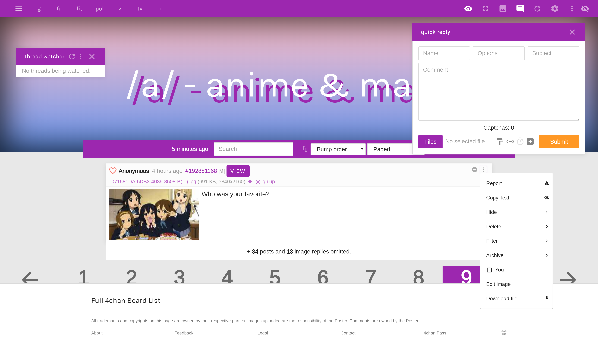

# ss16
a self-centered, fresh attempt at (user)styling 4chan

## late-2019 update
`2.1.0` is still expected to come soon<sup>tm</sup> with a complete rewrite in `.styl` and complete user control

## preview of ss16 applied


following the success (or lack of) from curabitr and xl, ss16 provides a fresh and clean userstyle for use with [ccd0's 4chan x](https://ccd0.github.io/4chan-x/) in 2019!

this style is currently being actively developed for chrome first, with firefox/edge as an after thought. you will require something that applies custom css, such as [stylus](http://add0n.com/stylus.html) (don't use stylish anymore), a userscript manager such as [tampermonkey](https://tampermonkey.net/), and a blocking extension such as [ublock origin](https://chrome.google.com/webstore/detail/ublock-origin/cjpalhdlnbpafiamejdnhcphjbkeiagm?hl=en).

## installation
1. install `ss16.user.css`, `ss16font.css`, and `ss16boardbanner.css` with stylus
2. install `sidedish.user.js` with tampermonkey
3. add the blocking filters below
4. cross your fingers and hope it works!

## blocker filters
a blocker is used to not only hide ads, but also block some other stuff to save on network requests.
go to your blocker-of-choice options, and locate where you can add your own filters. add the following:

```
4chan.org##script:inject(abort-current-inline-script.js, String.fromCharCode)
@@||4chan.org^*$csp=default-src 'self' * data: 'unsafe-inline' 'unsafe-eval'

4channel.org##script:inject(abort-current-inline-script.js, String.fromCharCode)
@@||4channel.org^*$csp=default-src 'self' * data: 'unsafe-inline' 'unsafe-eval'

*//s.4cdn.org/js/prettify/prettify.*.css
*//s.4cdn.org/css^$domain=boards.4chan.org
*//s.4cdn.org/css^$domain=boards.4channel.org
*//s.4cdn.org/image/title/*
*//s.4cdn.org/image/contest_banners/*
*//s.4cdn.org/js/core.min.*.js
*//s.4cdn.org/js/extension.min.*.js

@@||s.4cdn.org/css/flags.*.css
@@||s.4cdn.org/css/painter.*.css
@@||s.4cdn.org/css/yui.css
@@||s.4cdn.org/css/global.*.css
@@||s.4cdn.org/css/error.css
@@||4cdn.org$xmlhttprequest,domain=4chan.org
@@||4cdn.org$xmlhttprequest,domain=4channel.org
```

essentially:
 - block those bitcoin mining ads hiroshimoot uses
 - all 4chan css, with a few exceptions listed at the end
 - title and contest banners (technically skippable)
 - 4chan-JS code that isn't needed as we use 4chan x
 
### 4chan x filters
ss16 makes use of the highlighting feature in 4chan x to give certain posts extra styling. if you'd like to experience ss16 as intended, add these filters

#### post numbers
`/(\d)\1$/;highlight:post--dubs;top:no;boards:s4s` - posts with dubs vibrate and are checked on /s4s/

#### capcodes
`/Founder$/;highlight:poster--founder;op:yes`

`/Admin$/;highlight:poster--admin;op:yes`

`/Mod$/;highlight:poster--mod;op:yes`

`/Manager$/;highlight:poster--manager;op:yes`

`/Developer$/;highlight:poster--developer;op:yes`

`/Verified$/;highlight:poster--verified;op:yes`

#### pass dates
`/./;highlight:poster--pass;top:no;` - pass users are green

#### subject
`/./;op:only;top:no;highlight:thread--subject` - threads that have a subject are given a class

#### comment
`/^\W*(\w+\b\W*){50,90}$/;op:only;top:no;highlight:thread--long` - threads with a lot of characters given a special class

`/^\W*(\w+\b\W*){91,}$/;op:only;top:no;highlight:thread--extra-long` - threads with anything more than that, given another whole class

#### filenames
`/.webm$/;highlight:file--video;top:no;` - webm thumbnails have a play button

`/.gif$/;highlight:file--gif;top:no;` - gif thumbnails display `GIF`

#### image dimensions
`/\d{4}x/;highlight:file--wide;top:no;` - files that are at least 1000px wide, take up the whole screen

`/x\d{4}/;highlight:file--high;top:no;` - files that are at least 1000px high are given a class

#### filesize
`/MB/;op:yes;highlight:file--huge;top:no;` - files that are over a MB are given a discerning class (thanks, australia)