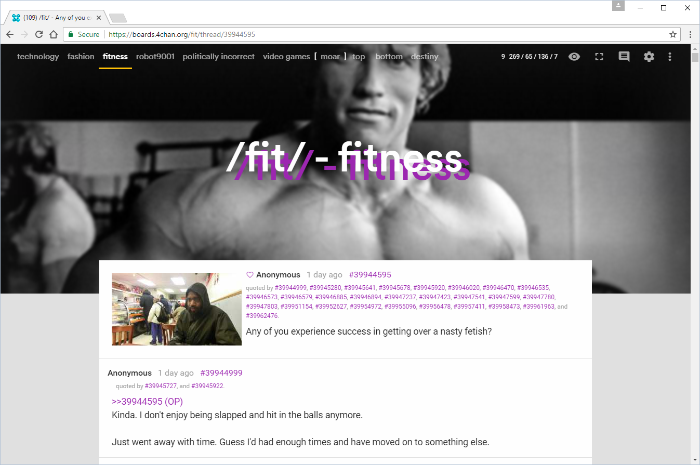
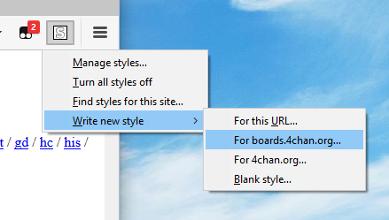

# ss16
a fresh attempt at a 4chan userstyle

## early-2017 update
ss16, even in 2017, is mainly the same as it was last year. a few minor changes to accommodate for 4chan x updates, [support for more settings](support.md), additional rice added via `sidedish` - and that's about it, sadly

## preview of userstyle applied


following the success (or lack of) from curabitr and xl, ss16 provides a fresh and clean userstyle for use with [ccd0's 4chan x](https://ccd0.github.io/4chan-x/) in 2017!

this style is currently being actively developed for use with chrome. you will require [stylish](https://chrome.google.com/webstore/detail/stylish/fjnbnpbmkenffdnngjfgmeleoegfcffe?hl=en), [tampermonkey](https://chrome.google.com/webstore/detail/tampermonkey/dhdgffkkebhmkfjojejmpbldmpobfkfo?hl=en), and [adblock plus](https://chrome.google.com/webstore/detail/adblock-plus/cfhdojbkjhnklbpkdaibdccddilifddb?hl=en).
stylish to apply the style, tampermonkey to add some extra rice, and adblock plus to disable the default 4chan stylesheets
firefox is also supported

## installation
__please note:__ only the most recent version of chrome and firefox are supported. at the time of this commit, that is 52 and 58, respectively
1.
  the easiest way to do this is to have one tab open on 4chan, and the raw version of `ss16.user.css` (found on this github repo)
2.
  create a new userstyle (named ss16) that applies to URLs on the domain `boards.4chan.org`
  
3.
  **chrome users:** copy everything from `ss16.user.css` and paste into the blank textarea and click save

  **firefox users:** you should be staring at something that looks like:

  ```css
  @namespace url(http://www.w3.org/1999/xhtml);

  @-moz-document domain("boards.4chan.org") {

  }
  ```

  you will need to copy everything from `ss16.user.css` and paste it into the `@document` query

  ```css
  @namespace url(http://www.w3.org/1999/xhtml);

  @-moz-document domain("boards.4chan.org") {
    /**
     *
     * ss16 - a self-centered, fresh attempt at (user)styling 4chan
     *
     */
     ...
  }
  ```

  you are then going to cut line 31:

  `@import url('https://fonts.googleapis.com/css?family=Roboto:400,500|Roboto+Mono|Material+Icons');
  `

  and paste it over

  `@namespace url(http://www.w3.org/1999/xhtml);`

  which should leave ss16 looking like (while you're at it change the double quotes to single quotes):

  ```css
  @import url('https://fonts.googleapis.com/css?family=Roboto:400,500|Roboto+Mono|Material+Icons');

  @-moz-document domain('boards.4chan.org') {
    /**
     *
     * ss16 - a self-centered, fresh attempt at (user)styling 4chan
     *
     */
     ...
  }
  ```

  and then click save

  __note:__ sadly, there is no auto updating on styles that are not installed from userstyles.org, so you'll have to check manually (honestly, the style is updated once every 2 months at most)
4.
  install 4chan X (you should already have it) and then navigate to the raw version of `sidedish.user.js` (found on this github repo). you should be automatically prompted to install with tampermonkey
5.
  speaking of 4chan X, have a read over [what is supported](support.md) and what you'll need to enable or disable


## adblock plus filters
adblock plus is used to not only hide ads, but also block some other stuff, saving us some http requests.
go to your adblock plus options, and locate where you can add your own filters. add the following:

| filter | description |
|--------|-------------|
| `||s.4cdn.org/css^$domain=boards.4chan.org` | block all css files, but only when they are on the `boards.4chan.org` subdomain (meaning `4chan.org` is unaffected) |
| `*//s.4cdn.org/image/title/*` | i never liked the banner images, so block them instead of loading them. technically, you can skip this one as i support it in ss16 |
| `*//s.4cdn.org/js/prettify/prettify.*.css` | code on /g/ is prettified, and we use a custom theme, so don't download the one 4chan uses |
| `@@||s.4cdn.org/css/flags.*.css` | adds an exception to the earlier rule, so that the flags file is still downloaded |
| `@@||s.4cdn.org/css/painter.*.css` | adds an exception to the earlier rule, so that the painter file is still downloaded |

in firefox, this should look something like this:


if you know a nicer/cleaner way to write these filters, please let me know

## plans
 - [a standalone, es6-based 4chan chrome extension](standalone.md)
