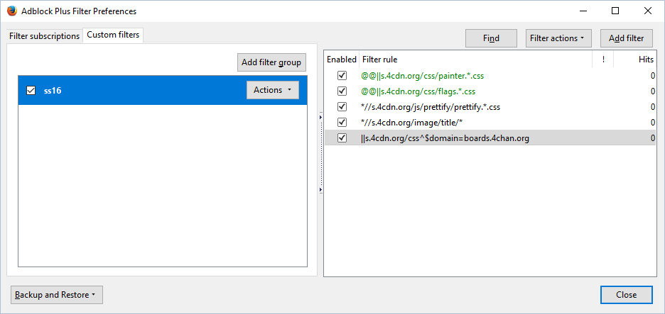

# ss16
a self-centered, fresh attempt at (user)styling 4chan

## early-2018 update
ss16 is now `2.0.0`, the ss18 release. install instructions are slightly different this time around, but there is a lot of work to still be done, so perhaps wait for a `2.1.0` release until things work themselves out

## [OUTDATED] preview of userstyle applied

following the success (or lack of) from curabitr and xl, ss16 provides a fresh and clean userstyle for use with [ccd0's 4chan X](https://ccd0.github.io/4chan-x/) in 2018!

this style is currently being actively developed for chrome first, with firefox as an after thought. you will require something that applies custom css, such as [stylus](http://add0n.com/stylus.html) (don't use stylish anymore), a userscript manager such as [tampermonkey](https://tampermonkey.net/), and an adblocking extension such as [adblock plus](https://chrome.google.com/webstore/detail/adblock-plus/cfhdojbkjhnklbpkdaibdccddilifddb?hl=en).

## installation
1. install `ss16.user.css`, `ss16font.css`, and `ss16boardbanner.css` with stylus
2. install `sidedish.user.js` with tampermonkey
3. add the filters below
4. cross your fingers and hope it works!

## adblock filters
an adblocker is used to not only hide ads, but also block some other stuff to save on http requests.
go to your adblock-of-choice options, and locate where you can add your own filters. add the following:

| filter | description |
|---|---|
| `\|\|s.4cdn.org/css^$domain=boards.4chan.org` | block all css files, but only when they are on the `boards.4chan.org` subdomain (meaning `4chan.org` is unaffected) |
| `*//s.4cdn.org/image/title/*` | i never liked the banner images, so block them instead of loading them. technically, you can skip this one as i support it in ss16 |
| `*//s.4cdn.org/js/prettify/prettify.*.css` | code on /g/ is prettified, and we use a custom theme, so don't download the one 4chan uses |
| `@@\|\|s.4cdn.org/css/flags.*.css` | adds an exception to the earlier rule, so that the flags file is still downloaded |
| `@@\|\|s.4cdn.org/css/painter.*.css` | adds an exception to the earlier rule, so that the painter file is still downloaded |

in firefox, this should look something like this:

if you know a nicer/cleaner way to write these filters, please let me know

## plans
 - [a standalone, es6-based 4chan chrome extension](standalone.md)
 - i'll make a roadmap thing in the issue tracker for future plans
